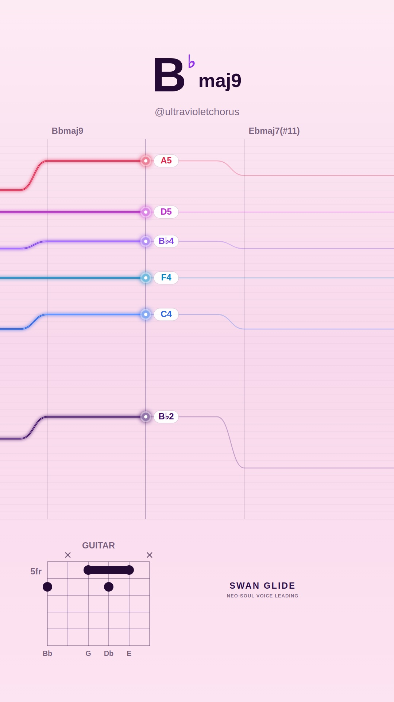
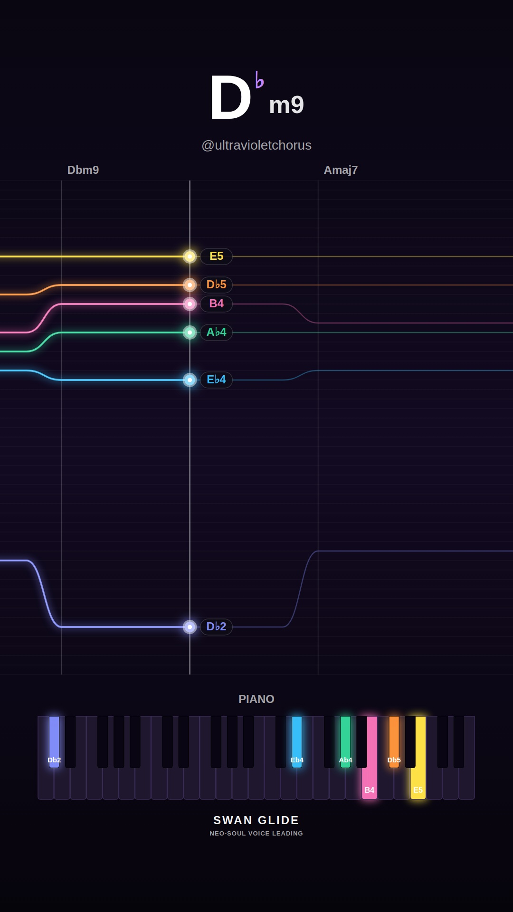
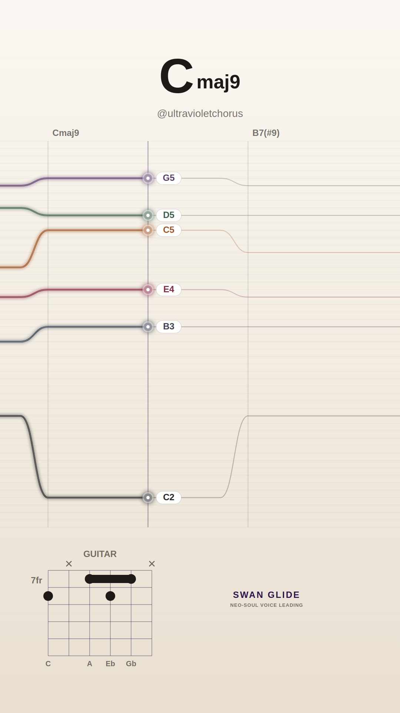
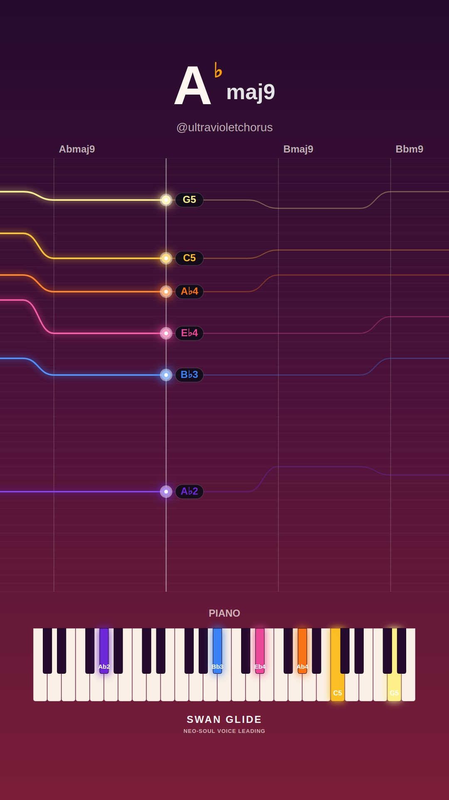
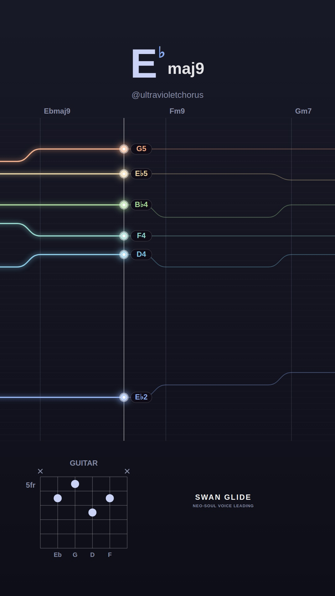
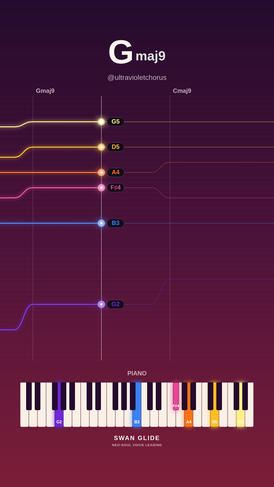
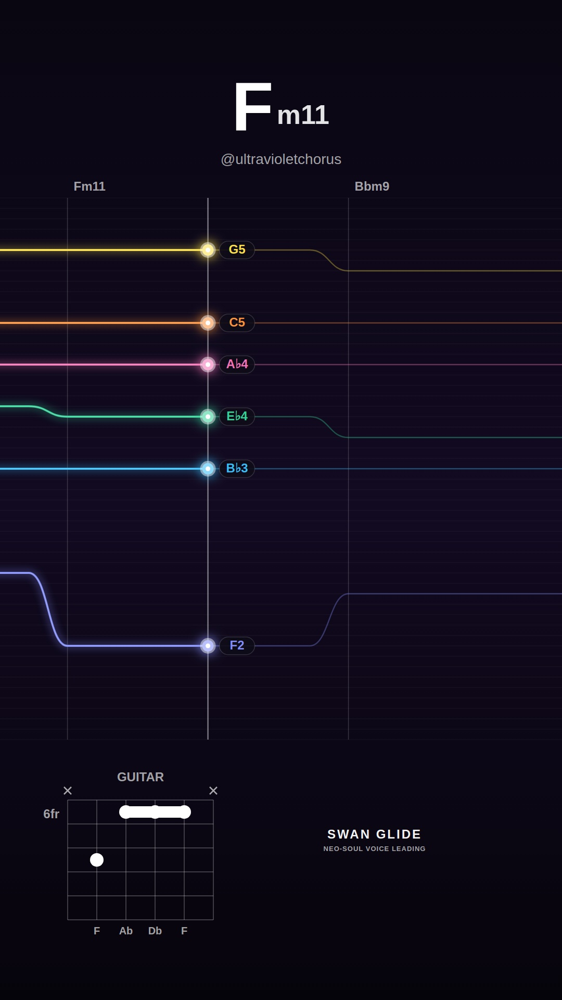
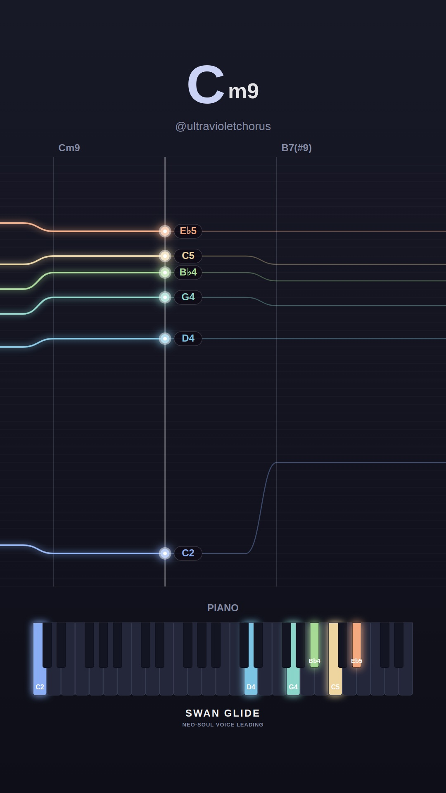
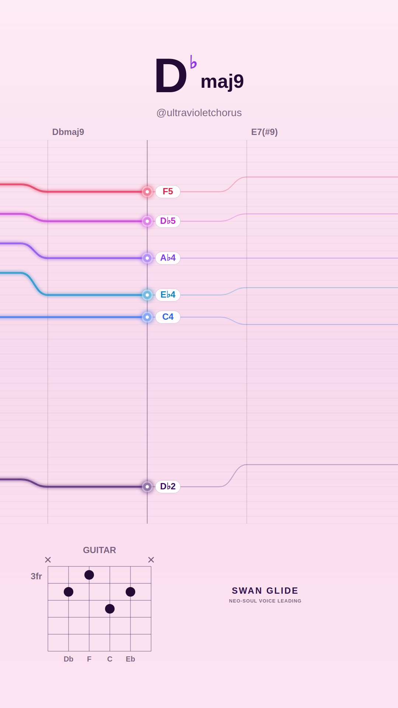
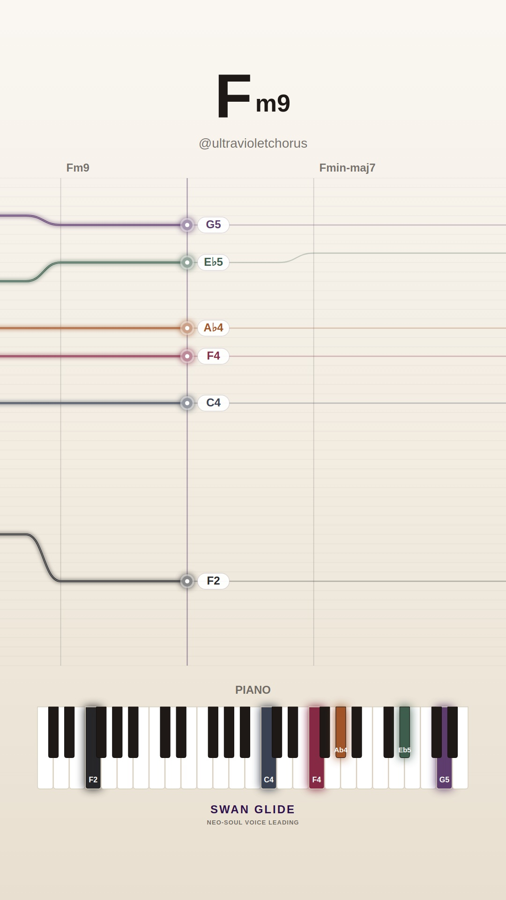

# 🕊️ Swan Glide Video Visualizer Gallery

Automated daily collection of procedural neo-soul jazz visualizers generated with the Swan Glide headless pipeline.

## 📅 Daily Archives
- [**2026-11-25**](./2026-11-25/README.md) (10 videos)
- [**2026-11-24**](./2026-11-24/README.md) (10 videos)
- [**2026-11-23**](./2026-11-23/README.md) (10 videos)
- [**2026-11-22**](./2026-11-22/README.md) (10 videos)
- [**2026-11-21**](./2026-11-21/README.md) (10 videos)
- [**2026-11-20**](./2026-11-20/README.md) (10 videos)
- [**2026-11-19**](./2026-11-19/README.md) (10 videos)
- [**2026-11-18**](./2026-11-18/README.md) (10 videos)
- [**2026-11-17**](./2026-11-17/README.md) (10 videos)
- [**2026-11-16**](./2026-11-16/README.md) (10 videos)
- [**2026-11-15**](./2026-11-15/README.md) (10 videos)
- [**2026-11-14**](./2026-11-14/README.md) (10 videos)
- [**2026-11-13**](./2026-11-13/README.md) (10 videos)
- [**2026-11-12**](./2026-11-12/README.md) (10 videos)
- [**2026-11-10**](./2026-11-10/README.md) (10 videos)
- [**2026-11-09**](./2026-11-09/README.md) (10 videos)
- [**2026-11-08**](./2026-11-08/README.md) (10 videos)
- [**2026-11-07**](./2026-11-07/README.md) (10 videos)
- [**2026-11-06**](./2026-11-06/README.md) (10 videos)
- [**2026-11-05**](./2026-11-05/README.md) (10 videos)
- [**2026-11-04**](./2026-11-04/README.md) (4 videos)

## ✨ Latest Daily Showcase (2026-11-25)

| # | Video Preview | Track & Harmony | Instrument & Theme | Chord Progression |
| :---: | :--- | :--- | :--- | :--- |
| **1** |  [▶️ **Watch Video**](./2026-11-25/song_1795632796_1_dreamy-major/video.mp4) | **Sunlit Waves (in Bb)** • Mood: `dreamy-major` • Key: **Bb** • Tempo: 65 BPM | 🎸 Guitar 🎨 Preset: `pastel` | `Bbmaj9` → `Ebmaj7(#11)` → `Dm7` → `Gm9` |
| **2** |  [▶️ **Watch Video**](./2026-11-25/song_1795632825_2_melancholy-minor/video.mp4) | **Shadows in Db (in Db)** • Mood: `melancholy-minor` • Key: **Db** • Tempo: 66 BPM | 🎹 Piano 🎨 Preset: `dark` | `Dbm9` → `Amaj7` → `Ebm7b5` → `Ab7(b13)` |
| **3** |  [▶️ **Watch Video**](./2026-11-25/song_1795632855_3_spicy-altered/video.mp4) | **Neon Midnight (in C)** • Mood: `spicy-altered` • Key: **C** • Tempo: 64 BPM | 🎸 Guitar 🎨 Preset: `cream` | `Cmaj9` → `B7(#9)` → `Em9` → `Dm9` → `G13` → `Cmaj7(#11)` → `B7(b13)` |
| **4** |  [▶️ **Watch Video**](./2026-11-25/song_1795632898_4_smooth-rnb/video.mp4) | **Smooth Glide (in Ab)** • Mood: `smooth-rnb` • Key: **Ab** • Tempo: 69 BPM | 🎹 Piano 🎨 Preset: `sunset` | `Abmaj9` → `Bmaj9` → `Bbm9` → `Eb13` → `Dbm9` → `Abmaj9` |
| **5** |  [▶️ **Watch Video**](./2026-11-25/song_1795632933_5_dreamy-major/video.mp4) | **Golden Hour Glow (in Eb)** • Mood: `dreamy-major` • Key: **Eb** • Tempo: 65 BPM | 🎸 Guitar 🎨 Preset: `lofi` | `Ebmaj9` → `Fm9` → `Gm7` → `Abmaj7(#11)` → `Cm9` → `Bb13` → `Abmaj9` → `Eb6/9` |
| **6** |  [▶️ **Watch Video**](./2026-11-25/song_1795632977_6_smooth-rnb/video.mp4) | **Silk & Honey (in G)** • Mood: `smooth-rnb` • Key: **G** • Tempo: 67 BPM | 🎹 Piano 🎨 Preset: `sunset` | `Gmaj9` → `Cmaj9` → `Bm7` → `Em9` → `Am9` → `D13` |
| **7** |  [▶️ **Watch Video**](./2026-11-25/song_1795633020_7_melancholy-minor/video.mp4) | **Shadows in Db (in F)** • Mood: `melancholy-minor` • Key: **F** • Tempo: 64 BPM | 🎸 Guitar 🎨 Preset: `dark` | `Fm11` → `Bbm9` → `Eb13` → `Abmaj9` → `Gm7b5` → `C7(b13)` |
| **8** |  [▶️ **Watch Video**](./2026-11-25/song_1795633065_8_spicy-altered/video.mp4) | **Spicy Diminished (in Bb)** • Mood: `spicy-altered` • Key: **Bb** • Tempo: 68 BPM | 🎹 Piano 🎨 Preset: `lofi` | `Cm9` → `B7(#9)` → `Bbmaj9` → `G7(b13)` → `Db7(#9)` |
| **9** |  [▶️ **Watch Video**](./2026-11-25/song_1795633093_9_spicy-altered/video.mp4) | **Tritone Whispers (in Db)** • Mood: `spicy-altered` • Key: **Db** • Tempo: 66 BPM | 🎸 Guitar 🎨 Preset: `pastel` | `Dbmaj9` → `E7(#9)` → `Ebm9` → `D7(b13)` |
| **10** |  [▶️ **Watch Video**](./2026-11-25/song_1795633121_10_melancholy-minor/video.mp4) | **Autumn Raindrops (in F)** • Mood: `melancholy-minor` • Key: **F** • Tempo: 65 BPM | 🎹 Piano 🎨 Preset: `cream` | `Fm9` → `Fmin-maj7` → `Fm7` → `Bbm9` |

*All videos rendered at 1080x1920 60FPS with 48kHz synthesized audio.*
