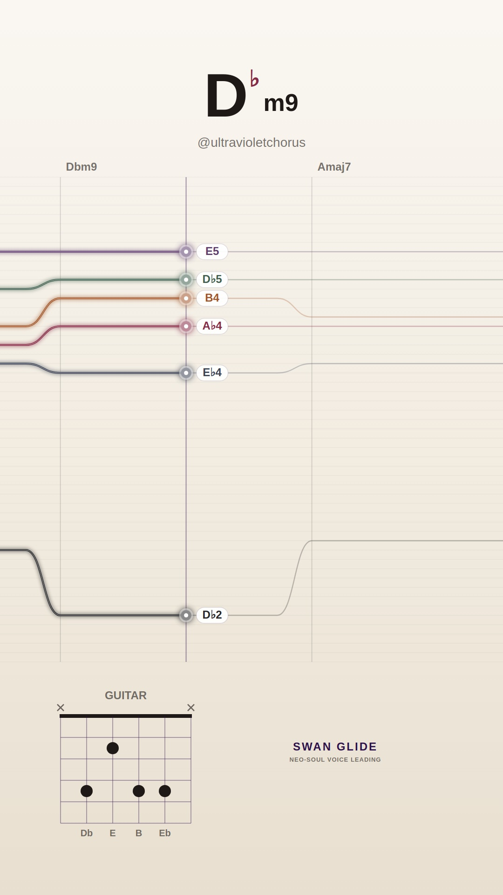
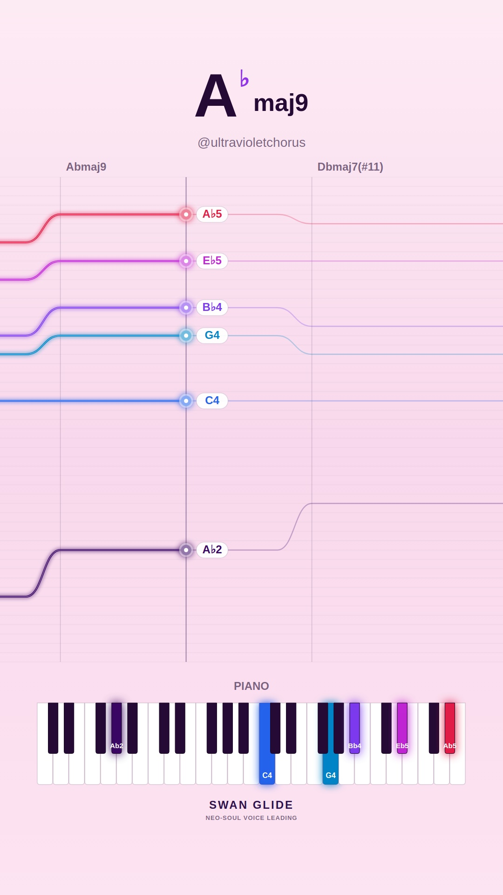
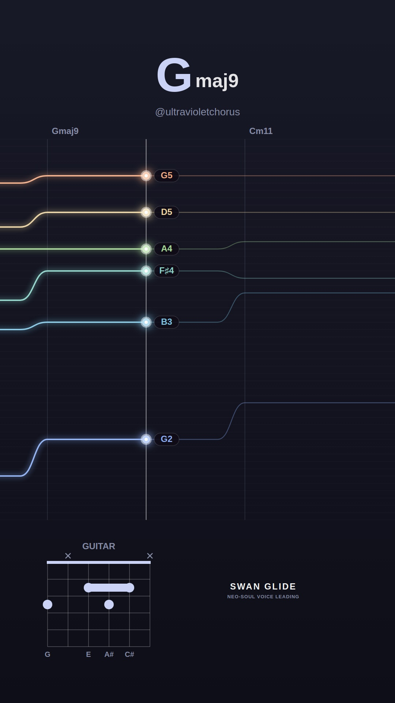
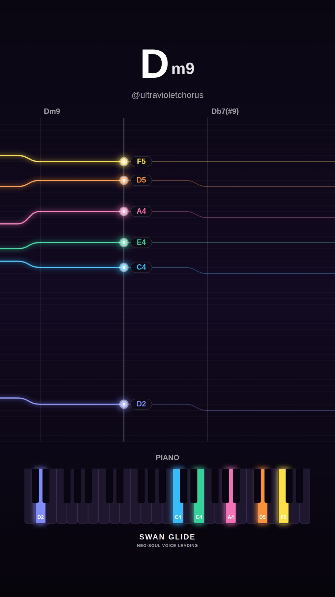
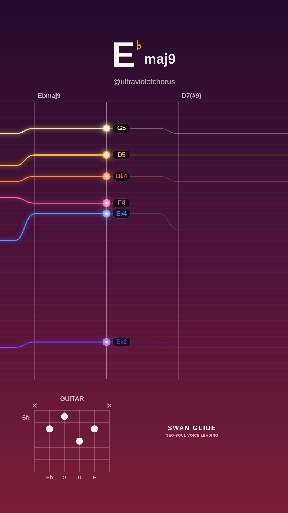
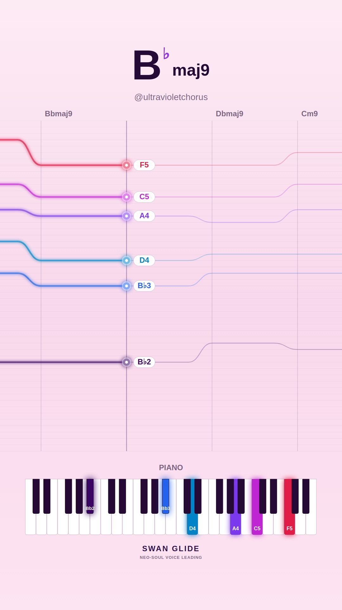
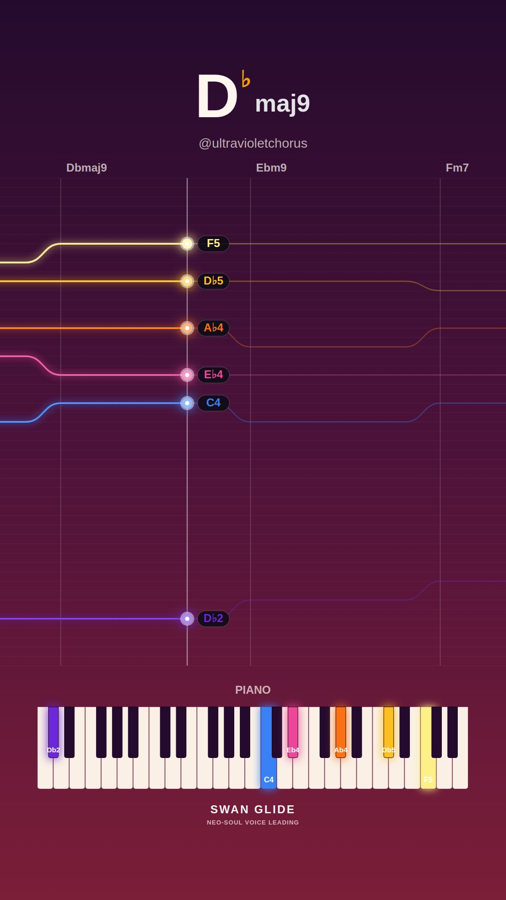
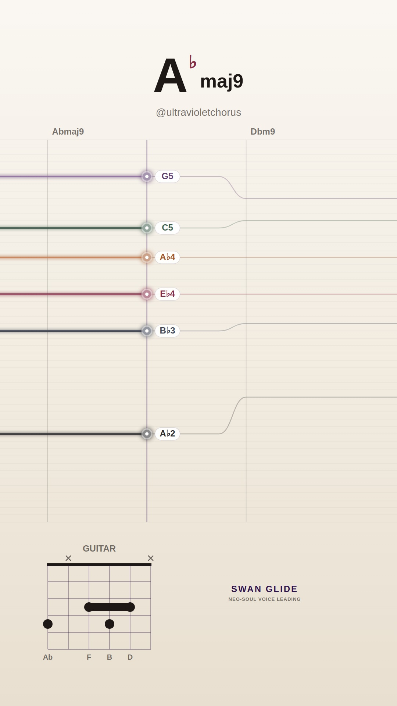
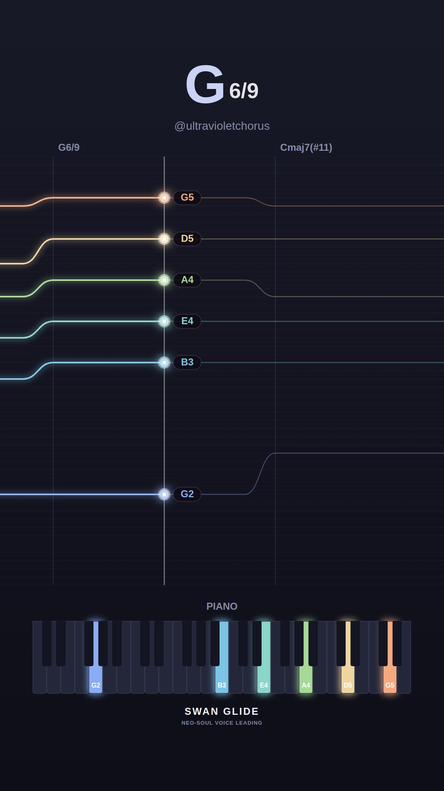

# 🕊️ Swan Glide Video Visualizer Gallery

Automated daily collection of procedural neo-soul jazz visualizers generated with the Swan Glide headless pipeline.

## 📅 Daily Archives
- [**2026-11-18**](./2026-11-18/README.md) (10 videos)
- [**2026-11-17**](./2026-11-17/README.md) (10 videos)
- [**2026-11-16**](./2026-11-16/README.md) (10 videos)
- [**2026-11-15**](./2026-11-15/README.md) (10 videos)
- [**2026-11-14**](./2026-11-14/README.md) (10 videos)
- [**2026-11-13**](./2026-11-13/README.md) (10 videos)
- [**2026-11-12**](./2026-11-12/README.md) (10 videos)
- [**2026-11-10**](./2026-11-10/README.md) (10 videos)
- [**2026-11-09**](./2026-11-09/README.md) (10 videos)
- [**2026-11-08**](./2026-11-08/README.md) (10 videos)
- [**2026-11-07**](./2026-11-07/README.md) (10 videos)
- [**2026-11-06**](./2026-11-06/README.md) (10 videos)
- [**2026-11-05**](./2026-11-05/README.md) (10 videos)
- [**2026-11-04**](./2026-11-04/README.md) (4 videos)

## ✨ Latest Daily Showcase (2026-11-18)

| # | Video Preview | Track & Harmony | Instrument & Theme | Chord Progression |
| :---: | :--- | :--- | :--- | :--- |
| **1** |  [▶️ **Watch Video**](./2026-11-18/song_1795023630_1_melancholy-minor/video.mp4) | **Distant Blue (in Db)** • Mood: `melancholy-minor` • Key: **Db** • Tempo: 66 BPM | 🎸 Guitar 🎨 Preset: `cream` | `Dbm9` → `Amaj7` → `Ebm7b5` → `Ab7(b13)` |
| **2** |  [▶️ **Watch Video**](./2026-11-18/song_1795023666_2_dreamy-major/video.mp4) | **Velvet Horizon (in Ab)** • Mood: `dreamy-major` • Key: **Ab** • Tempo: 64 BPM | 🎹 Piano 🎨 Preset: `pastel` | `Abmaj9` → `Dbmaj7(#11)` → `Cm9` → `Fm9` → `Bbm9` → `Eb13` |
| **3** |  [▶️ **Watch Video**](./2026-11-18/song_1795023722_3_smooth-rnb/video.mp4) | **Late Night Call (in G)** • Mood: `smooth-rnb` • Key: **G** • Tempo: 73 BPM | 🎸 Guitar 🎨 Preset: `lofi` | `Gmaj9` → `Cm11` → `F13` → `Am9` → `D7(b13)` |
| **4** |  [▶️ **Watch Video**](./2026-11-18/song_1795023755_4_spicy-altered/video.mp4) | **Chromatic Glide (in C)** • Mood: `spicy-altered` • Key: **C** • Tempo: 68 BPM | 🎹 Piano 🎨 Preset: `dark` | `Dm9` → `Db7(#9)` → `Cmaj9` → `A7(b13)` → `Eb7(#9)` |
| **5** |  [▶️ **Watch Video**](./2026-11-18/song_1795023790_5_spicy-altered/video.mp4) | **After Hours Jazz (in Eb)** • Mood: `spicy-altered` • Key: **Eb** • Tempo: 64 BPM | 🎸 Guitar 🎨 Preset: `sunset` | `Ebmaj9` → `D7(#9)` → `Gm9` → `Fm9` → `Bb13` → `Ebmaj7(#11)` → `D7(b13)` |
| **6** |  [▶️ **Watch Video**](./2026-11-18/song_1795023843_6_smooth-rnb/video.mp4) | **Late Night Call (in Bb)** • Mood: `smooth-rnb` • Key: **Bb** • Tempo: 69 BPM | 🎹 Piano 🎨 Preset: `pastel` | `Bbmaj9` → `Dbmaj9` → `Cm9` → `F13` → `Ebm9` → `Bbmaj9` |
| **7** |  [▶️ **Watch Video**](./2026-11-18/song_1795023887_7_melancholy-minor/video.mp4) | **Paper Lanterns (in F)** • Mood: `melancholy-minor` • Key: **F** • Tempo: 65 BPM | 🎸 Guitar 🎨 Preset: `dark` | `Fm9` → `Fmin-maj7` → `Fm7` → `Bbm9` → `Gm7b5` → `C7(b13)` → `Fm11` |
| **8** |  [▶️ **Watch Video**](./2026-11-18/song_1795023931_8_dreamy-major/video.mp4) | **Lydian Shimmer (in Db)** • Mood: `dreamy-major` • Key: **Db** • Tempo: 65 BPM | 🎹 Piano 🎨 Preset: `sunset` | `Dbmaj9` → `Ebm9` → `Fm7` → `Gbmaj7(#11)` → `Bbm9` → `Ab13` → `Gbmaj9` → `Db6/9` |
| **9** |  [▶️ **Watch Video**](./2026-11-18/song_1795023989_9_smooth-rnb/video.mp4) | **Late Night Call (in Ab)** • Mood: `smooth-rnb` • Key: **Ab** • Tempo: 70 BPM | 🎸 Guitar 🎨 Preset: `cream` | `Abmaj9` → `Dbm9` → `Gb13` → `Abmaj9` |
| **10** |  [▶️ **Watch Video**](./2026-11-18/song_1795024019_10_dreamy-major/video.mp4) | **Lydian Shimmer (in G)** • Mood: `dreamy-major` • Key: **G** • Tempo: 68 BPM | 🎹 Piano 🎨 Preset: `lofi` | `G6/9` → `Cmaj7(#11)` → `Fmaj9` → `Gmaj9` |

*All videos rendered at 1080x1920 60FPS with 48kHz synthesized audio.*
